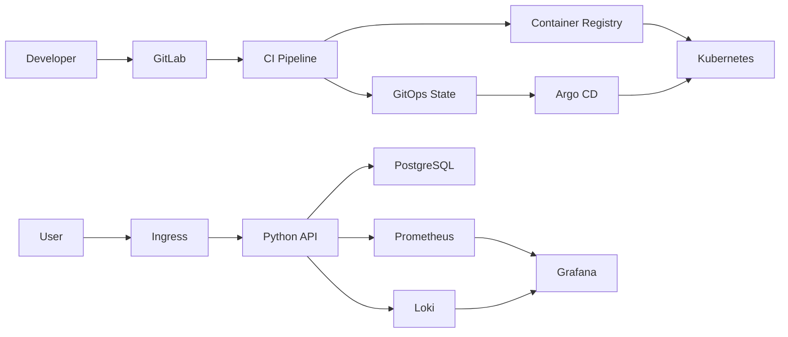

# Итоговый проект

## Цель

Показать сквозной путь изменения от Git до наблюдаемого и восстанавливаемого
сервиса. Проект специально мал по бизнес-логике: оцениваться должны delivery,
security, reliability и способность объяснить решения.

## Решения

- Immutable image получает tag commit SHA; version tag — только дополнение.
- CI проверяет код и security до публикации.
- GitOps-контроллер, а не CI credential, изменяет кластер.
- `/health` проверяет процесс, `/ready` — критическую dependency.
- Контейнер non-root, read-only, без Linux capabilities.
- Secret создаётся внешним способом; chart не содержит его значения.
- Terraform state и credentials не хранятся в Git.
- Alerts привязаны к пользовательским симптомам и runbooks.

## Threat model

| Угроза | Контроль |
|---|---|
| Секрет в Git/логе | ignored `.env`, masked variables, secret scan, rotation |
| Подмена image tag | SHA/digest, restricted registry push |
| Компрометация Pod | non-root, read-only FS, drop ALL, no token |
| Lateral movement | NetworkPolicy и отдельные namespaces |
| Избыточный cloud access | service account и least privilege |
| Supply-chain CVE | dependency/container scan и quality gate |
| Потеря данных | off-site encrypted backup и restore drill |

Учебные placeholders (`registry.example.com`, `gitlab.example.com`) необходимо
заменить собственными адресами. Реальные токены и пароли не добавляются.

## Definition of done

- [ ] Новый пользователь воспроизводит локальный запуск по README.
- [ ] Tests, Ruff, ShellCheck, Compose config, Helm lint, Terraform validate и
      Ansible syntax check проходят.
- [ ] CI публикует image по commit SHA и chart только после gates.
- [ ] Kubernetes rollout и rollback продемонстрированы.
- [ ] Argo CD исправляет ручной drift.
- [ ] Dashboard показывает RED, alert срабатывает и восстанавливается.
- [ ] Backup восстановлен в чистую БД; фактический RTO записан.
- [ ] Проведён failure drill и заполнен blameless postmortem.
- [ ] В Git history и CI logs отсутствуют secrets.

## Сценарий защиты

1. За две минуты объяснить архитектуру и trust boundaries.
2. С чистого clone запустить tests и локальный стек.
3. Из feature branch изменить endpoint; показать test и merge request.
4. Проследить CI → SHA image → GitOps commit → Argo sync.
5. Вызвать плохой rollout, показать alert/log/request ID и rollback.
6. Восстановить тестовую БД из backup.
7. Показать SLO/error budget, postmortem и следующие улучшения.

Не выдавайте локальный Compose или Kind за production. На защите отдельно
назовите недостающие production-компоненты: HA control plane/DB, remote state,
managed secrets, off-site backups, TLS/DNS, autoscaling, centralized IAM,
policy enforcement и capacity/cost planning.
